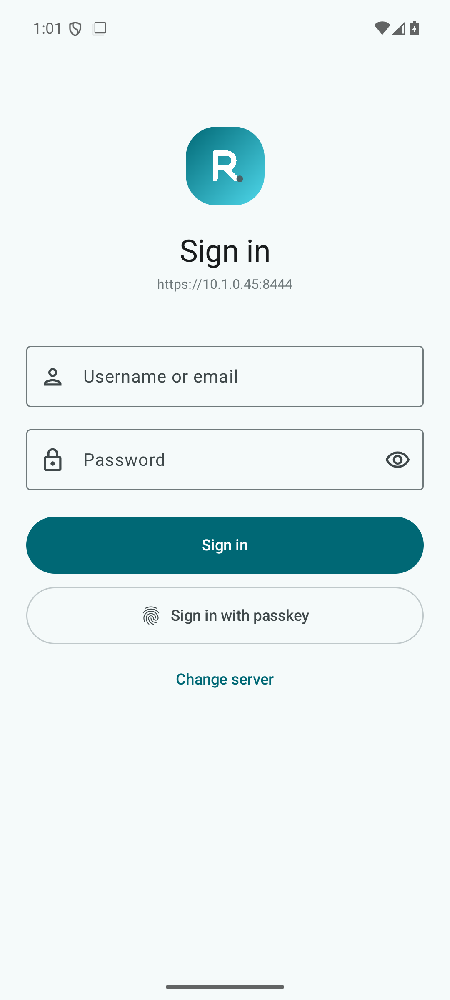
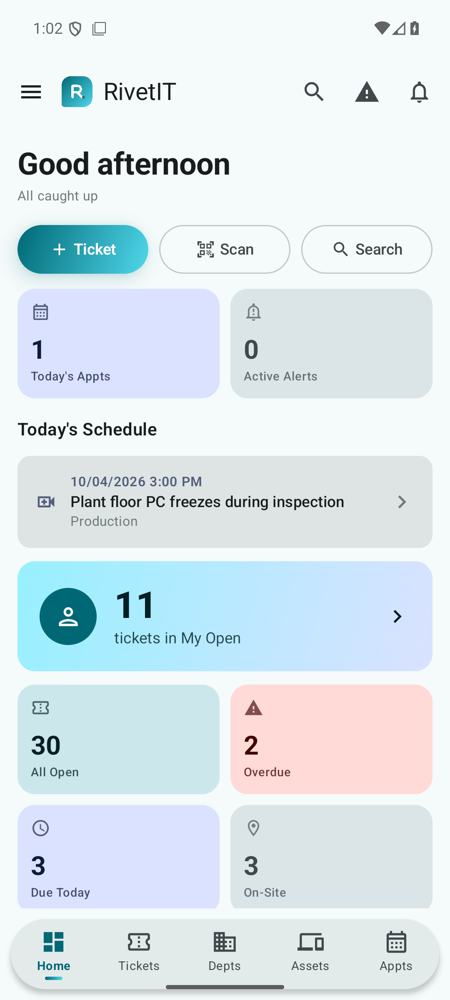
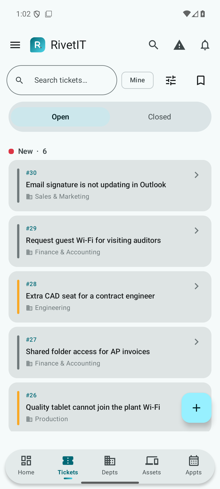
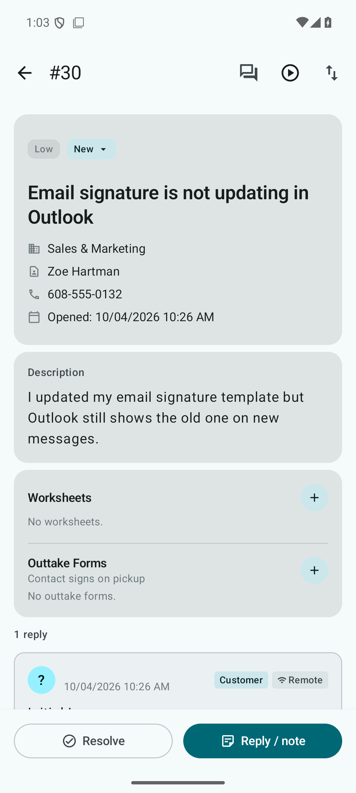
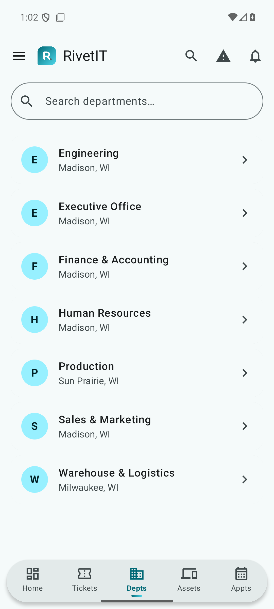
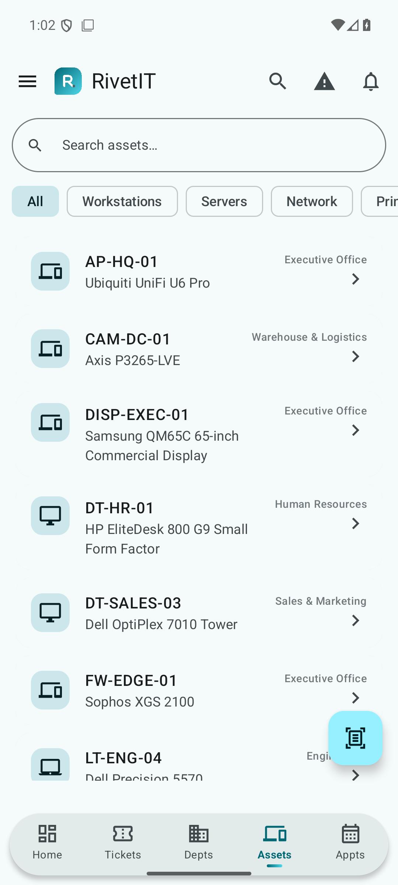
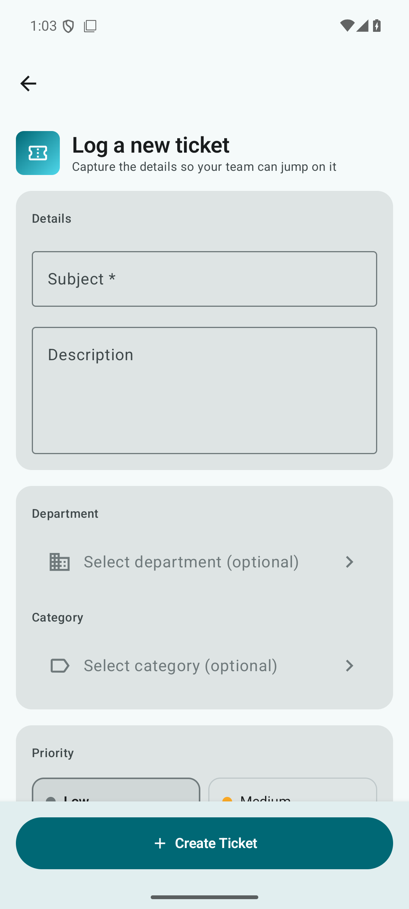
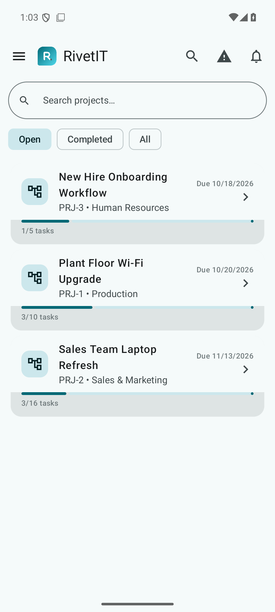

# RivetIT-Mobile

The native Android companion for [RivetIT](https://github.com/TheTractorHacker/RivetIT), built with Kotlin, Jetpack Compose, and Material 3. This is the internal IT edition: it uses Departments in the UI and keeps the existing `client`/`client_id` API fields for server compatibility. Billing screens follow the connected server's module settings.

## Screenshots

Captured on a Pixel 7 (Android 36) against a demo server with fictional data.

<table>
<tr><td align="center" width="25%"><b>Sign in</b></td><td align="center" width="25%"><b>Dashboard</b></td><td align="center" width="25%"><b>Tickets</b></td><td align="center" width="25%"><b>Ticket detail</b></td></tr>
<tr><td></td><td></td><td></td><td></td></tr>
</table>

<table>
<tr><td align="center" width="25%"><b>Departments</b></td><td align="center" width="25%"><b>Assets</b></td><td align="center" width="25%"><b>New ticket</b></td><td align="center" width="25%"><b>Projects</b></td></tr>
<tr><td></td><td></td><td></td><td></td></tr>
</table>

## Features

Tickets, public replies and internal notes, live chat, appointments, assets and barcode scanning, departments, credentials, projects, contracts, worksheets, knowledge base, alerts, notifications, search, reports, and optional billing modules.

## Install and setup

Download a beta APK from the [Actions workflow](https://github.com/TheTractorHacker/RivetIT-Mobile/actions/workflows/build.yml) or a published release. Enter your RivetIT server URL, then sign in with a technician account. Source builds require Android SDK 36 and a valid `app/google-services.json` for Firebase push notifications; the checked-in file is only a placeholder.

The application ID remains `com.foleyit.itflow.internal` (`.beta` for debug builds) so existing installations can update without losing their local settings. The legacy Java/Kotlin package namespace and API route names are also retained for compatibility.

### Beta APK signing limitation

Beta APKs are debug builds signed with the public, committed `app/debug.keystore` (password `android`) and are debuggable. Anyone can build an APK with the same application ID and signature, so install betas only from this repository's releases and treat them as test builds, not production. Passkey Digital Asset Links trust the same public fingerprint for the beta ID. Planned fix: sign distributed betas with a CI-secret key (separate from the release key), register that fingerprint, and ship a non-debuggable `beta` build type. Use the signed release build for production.

## Development

`main` is the RivetIT-Mobile branch. Pushes run lint and unit tests and produce a beta APK. Version tags also trigger a signed release build when the repository's signing secrets are configured. Run local checks with `./gradlew :app:testDebugUnitTest :app:lintDebug`.

[Issue #9 screen audit](docs/issue-9-android-screen-audit.md) tracks UI review and device verification. The screenshots above were captured from a QA build (`./gradlew :app:assembleDebug -PqaScreenshots=true`), which is the only build that disables `FLAG_SECURE`.

RivetIT-Mobile is based on ITFlow and is not the official ITFlow app.
